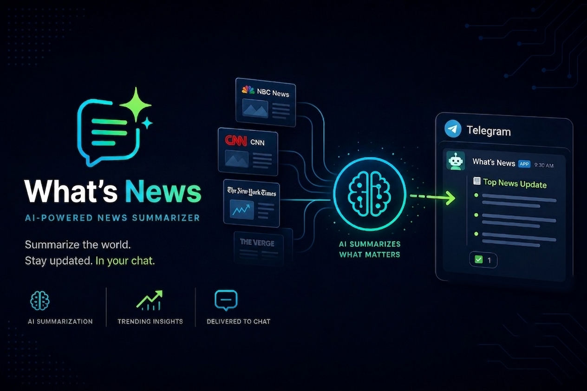

# WhatsNews



What's News fetches US Google Trends records from the past 24 hours, ranks them by
search volume, finds the top Google News RSS stories for each top trend, and
summarizes the news with OpenRouter.

## Setup

Install dependencies:

```powershell
uv sync
```

Set your OpenRouter and Telegram credentials before running:

```powershell
$env:OPENROUTER_API_KEY = "your-openrouter-api-key"
$env:TELEGRAM_BOT_TOKEN = "your-telegram-bot-token"
$env:TELEGRAM_CHAT_ID = "your-telegram-chat-id"
```

You can also put these values in a local `.env` file at the project root. The
app loads missing environment variables from `.env`, and `.env` is ignored by
Git.

The OpenRouter model, fallback model, prompt path, limits, and output locations
are configured in `config.toml`. The default model is `google/gemini-3.5-flash`
with `z-ai/glm-5.2` as fallback, and the system prompt lives in
`prompts/news-summary.txt`.

## Run

```powershell
uv run python main.py
```

The pipeline writes:

- Raw Google Trends CSV files to `downloads/`
- Final summaries to `outputs/trend_news_summary_<timestamp>.csv`
- Formatted Telegram messages containing all summary rows, split across
  multiple messages when needed

## Output Schema

The final CSV contains exactly 20 rows and these columns:

- `Trends`
- `Search volume`
- `Started`
- `LLM summary`
- `Related US stock`
- `News sentiment score`

`Related US stock` contains comma-separated US ticker symbols mentioned in the
news content, or a blank value if none are mentioned. `News sentiment score` is
an integer from 1 to 10, where 1 is very negative, 5 is neutral, and 10 is very
positive.

## Notes and Limitations

- Chrome must be installed because `trendspyg` uses Google Trends CSV export.
- Google News RSS is unofficial and can change without notice.
- Publisher pages may block article extraction, redirect resolution, or sit
  behind paywalls; in that case, the pipeline falls back to Google News RSS
  title/source/description.
- OpenRouter cost and latency depend on the configured model and current news
  article length. The default settings make one LLM request per trend.
